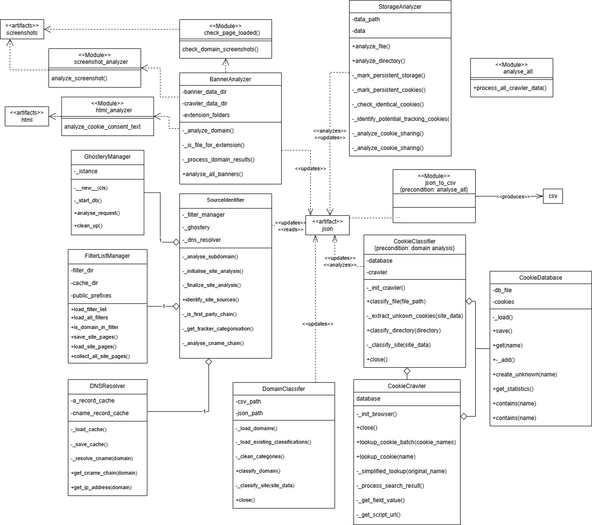

# Web Privacy and Cookie Consent Banner Analysis

## Overview

This repository contains the implementation and analysis tools for a master's thesis project focused on web privacy, specifically analyzing cookie consent banners and the effectiveness of various browser extensions and privacy tools.

## Project Description

This research project investigates the impact of different browser extensions and privacy tools on web tracking and cookie consent mechanisms. The study analyzes how various privacy-enhancing technologies affect the behavior of websites, particularly focusing on:

- **Cookie Consent Banners**: Analysis of how different privacy tools interact with cookie consent mechanisms
- **Browser Extensions**: Evaluation of popular privacy extensions like uBlock Origin, Privacy Badger, Ghostery, and others
- **Network Traffic Analysis**: Examination of HTTP vs HTTPS protocol usage and third-party tracking
- **Data Collection Patterns**: Understanding how websites adapt their tracking strategies based on privacy tools

## Key Features

### 🕷️ Automated Web Crawling
- **Parallel Crawling**: Multi-profile browser automation for efficient data collection
- **Profile Management**: Support for 18+ different browser profiles with various privacy extensions
- **Screenshot Capture**: Automated capture of cookie consent banners and page states
- **Network Traffic Recording**: Comprehensive logging of all network requests and responses

### 📊 Analysis Tools
- **Protocol Analysis**: HTTP vs HTTPS usage analysis across different privacy tools
- **Banner Detection**: Automated identification and classification of cookie consent banners
- **Storage Analysis**: Examination of cookies, localStorage, and sessionStorage usage
- **Source Identification**: Tracking of third-party domains and their purposes
- **Cookie Classification**: Categorization of cookies by function and privacy impact

### 🔧 Privacy Extensions Tested
- **Ad Blockers**: uBlock Origin, AdBlock Plus, AdGuard
- **Privacy Tools**: Privacy Badger, Disconnect, Ghostery
- **Cookie Managers**: Consent-O-Matic, I Don't Care About Cookies, Cookie Cutter
- **Consent Automation**: Super Agent, Accept All Cookies

## Research Methodology

1. **Data Collection**: Automated crawling of top websites using different browser profiles
2. **Banner Analysis**: Screenshot and HTML analysis of cookie consent mechanisms
3. **Network Analysis**: Protocol usage and third-party tracking examination
4. **Comparative Study**: Effectiveness evaluation across different privacy tools
5. **Statistical Analysis**: Quantitative assessment of privacy protection measures

## Key Findings

The research provides insights into:
- Effectiveness of different privacy extensions
- Website adaptation strategies to privacy tools
- Protocol security practices in web tracking
- Cookie consent banner behavior patterns
- Third-party tracking prevalence and methods

## Data Privacy

This project is designed for academic research purposes. All data collection follows ethical guidelines and is used solely for privacy research analysis.

## Author

**Nicklas Enøe Vrede**  
Master's Thesis Project  
University of Southern Denmark (SDU)

## System Architecture

Below are diagrams illustrating the main components and data flow in this project:

### Analysis Pipeline

### Crawler Architecture

---

*This repository contains the implementation and analysis tools for research on web privacy and cookie consent mechanisms. The project investigates the effectiveness of various privacy-enhancing technologies and their impact on web tracking practices.* 